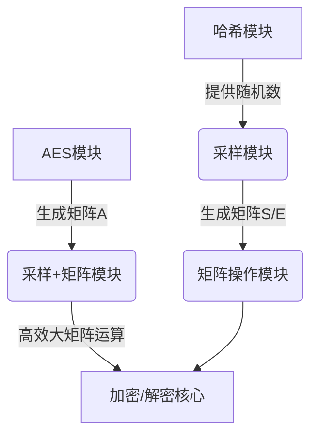
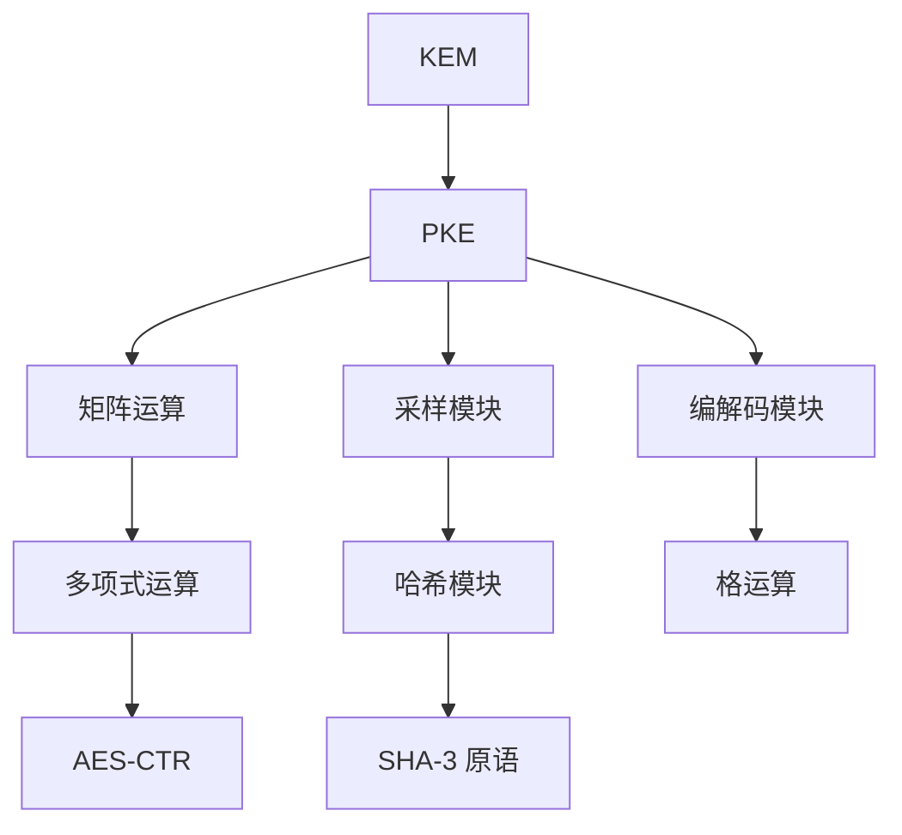

# scloudplus 实现文档

## 1. 密码学原语模块

### 1. AES 模块 (aes.c/aes.h)

#### 功能概述

提供高性能的 AES-128 CTR 模式加密实现，支持 x86 (AES-NI) 和 ARM (ARMv8 Crypto) 硬件加速。

#### 核心函数

```c
/**
 * 加载 AES-128 轮密钥调度表
 * @param key       输入 - 16字节 AES-128 密钥
 * @param schedule  输出 - 轮密钥调度表 (176字节)
 */
void AES128_load_schedule(const uint8_t *key, uint8_t *schedule);

/**
 * 使用预计算的轮密钥进行 AES-128 CTR 模式加密
 * @param plaintext      输入 - 明文数据
 * @param plaintext_len  输入 - 明文长度 (必须为16字节整数倍)
 * @param schedule       输入 - 预计算的轮密钥表
 * @param ciphertext     输出 - 密文缓冲区 (大小 >= plaintext_len)
 */
void AES128_CTR_enc_sch(const uint8_t *plaintext, size_t plaintext_len,
                        const uint8_t *schedule, uint8_t *ciphertext);

/**
 * 安全擦除轮密钥调度表
 * @param schedule  输入 - 待清除的轮密钥表
 */
void AES128_free_schedule(uint8_t *schedule);
```

#### 技术特性

| 特性       | ARMv8 实现                       | x86_64 实现                          |
|----------|--------------------------------|------------------------------------|
| **指令集**  | ARMv8 Crypto Extensions (NEON) | Intel AES-NI                       |
| **关键指令** | `vaeseq_u8`, `vaesmcq_u8`      | `_mm_aesenc_si128`                 |
| **密钥扩展** | 软件实现 (查表法)                     | 硬件加速 (`_mm_aeskeygenassist_si128`) |
| **安全标准** | FIPS 197 兼容                    | FIPS 197 兼容                        |

#### 安全注意事项

1. **密钥安全**：
    - 轮密钥调度表在内存中以明文形式存在
    - 使用后必须调用 `AES128_free_schedule()` 安全擦除

2. **使用约束**：
    - 输入长度必须是 16 字节的整数倍 (CTR模式需要完整块)
    - 计数器(CTR)管理由调用方负责实现

3. **侧信道防护**：
    - 硬件指令提供恒定时间执行，抵抗时序攻击
    - 密钥擦除使用安全的内存清零操作

#### 采样算法调用流程

```c
uint8_t key[16] = {...}; // AES-128 密钥
uint8_t schedule[16 * 11]; // 轮密钥缓冲区

// 1. 加载轮密钥
AES128_load_schedule(key, schedule);

// 2. 加密数据
// 需自行处理CTR计数器,需调用次数为m*n*2/16,在192和256强度下大于2^16,
// 因此使用u32存储
uint16_t AROWOUT[4 * scloudplus_n];
uint32_t AROWIN[4 * scloudplus_block_rowlen];
AES128_CTR_enc_sch(AROWIN, 4 * scloudplus_n * 2, schedule, AROWOUT);

// 3. 立即清除轮密钥
AES128_free_schedule(schedule);
```

#### 实现说明

1. **多架构支持**：
    - 自动检测 CPU 架构 (x86_64 或 ARM64(需支持ARMv8 Crypto))
    - 不支持其他架构 (编译时报错)

2. **性能优化**：
    - ARM: 使用NEON单指令多数据(SIMD)并行处理
    - x86: 使用AES-NI专用加密指令

3. **错误处理**：
    - 检查输入长度有效性 (ARM实现)
    - x86实现使用assert验证块对齐

### 2. 哈希模块 (hash.c/hash.h)

#### 功能概述

基于 Keccak 算法实现 SHA-3 系列密码学原语，为 scloudplus 方案提供核心哈希功能。

#### 核心组件 (开源实现)

```c
/* SHA3 固定长度哈希 */
void sha3_256(uint8_t* output, const uint8_t* input, size_t inlen);   // 256-bit 输出
void sha3_512(uint8_t* output, const uint8_t* input, size_t inlen);   // 512-bit 输出

/* SHAKE 可扩展输出函数(XOF) */
void shake128_init(shake128_ctx* ctx);
void shake128_absorb(shake128_ctx* ctx, const uint8_t* input, size_t inlen);
void shake128_squeeze(uint8_t* output, size_t outlen, shake128_ctx* ctx);

void shake256_init(shake256_ctx* ctx);
void shake256_absorb(shake256_ctx* ctx, const uint8_t* input, size_t inlen);
void shake256_squeeze(uint8_t* output, size_t outlen, shake256_ctx* ctx);
```

#### 方案专用包装函数

```c
/**
 * F 函数: 伪随机函数(PRF)
 * 输入: 256-bit 固定长度数据
 * 输出: 任意长度比特流
 * 实现: SHAKE256
 */
void scloudplus_F(uint8_t* output, size_t outlen, const uint8_t input[32]);

/**
 * H 函数: 密码学哈希
 * 输入: 任意长度数据
 * 输出: 256-bit 固定长度摘要
 * 实现: SHA3-256
 */
void scloudplus_H(uint8_t output[32], const uint8_t* input, size_t inlen);

/**
 * G 函数: 密钥派生函数(KDF)
 * 输入: 任意长度数据
 * 输出: 512-bit 固定长度输出 (2×256-bit 连接)
 * 实现: SHA3-512
 */
void scloudplus_G(uint8_t output[64], const uint8_t* input, size_t inlen);

/**
 * K 函数: 密钥派生函数(KDF)
 * 输入: 任意长度数据
 * 输出: 长度可变的比特流 (lss 字节)
 * 实现: SHAKE256
 */
void scloudplus_K(uint8_t* output, size_t lss, const uint8_t* input, size_t inlen);
```

#### 密码学特性说明

| 函数             | 类型  | 安全属性           | 标准实现     |
|----------------|-----|----------------|----------|
| `scloudplus_F` | PRF | 抗碰撞性, 随机预言机    | SHAKE256 |
| `scloudplus_H` | 哈希  | 抗原像攻击, 抗长度扩展攻击 | SHA3-256 |
| `scloudplus_G` | KDF | 确定性密钥派生        | SHA3-512 |
| `scloudplus_K` | KDF | 可变长度输出         | SHAKE256 |

#### 实现说明

1. **底层算法**：
    - SHA3-256/512 符合 NIST FIPS 202 标准
    - SHAKE256 符合 NIST SP 800-185 标准

2. **内存安全**：  
   所有函数明确定义输入/输出缓冲区长度，避免缓冲区溢出风险

3. **性能优化**：  
   Keccak-f[1600] 轮函数使用 64-bit 优化实现

4. **输出处理**：
    - `scloudplus_G()` 输出为 64 字节，使用时需拆分为两个 32 字节字段
    - `scloudplus_K()` 的 `lss` 参数根据安全需求动态确定（如 AES 密钥长度）

## 2. 核心算法模块

### 1. 矩阵操作模块 (matrix.c/matrix.h)

#### 功能概述

提供基于整数的矩阵基本运算，包括加法、减法和乘法。所有操作在有限域上执行（模 4096），并针对性能进行了优化设计。

#### 核心函数

```c
/**
 * 矩阵加法: out = in0 + in1 (模 4096)
 * @param in0  输入矩阵1 (长度 len)
 * @param in1  输入矩阵2 (长度 len)
 * @param len  矩阵元素个数
 * @param out  输出矩阵 (长度 len)
 */
void scloudplus_add(uint16_t *in0, uint16_t *in1, int len, uint16_t *out);

/**
 * 矩阵减法: out = in0 - in1 (模 4096)
 * @param in0  输入矩阵1 (长度 len)
 * @param in1  输入矩阵2 (长度 len)
 * @param len  矩阵元素个数
 * @param out  输出矩阵 (长度 len)
 */
void scloudplus_sub(uint16_t *in0, uint16_t *in1, int len, uint16_t *out);

/**
 * 矩阵乘法: out = C * S (模 4096)
 * @param C     输入矩阵 C (维度 mbar x n)
 * @param S     输入矩阵 S (维度 n x nbar)
 * @param out   输出矩阵 (维度 mbar x nbar)
 */
void scloudplus_mul_cs(uint16_t *C, uint16_t *S, uint16_t *out);

/**
 * 矩阵乘加: out = S * B + E (模 4096)
 * @param S     输入矩阵 S (维度 mbar x m)
 * @param B     输入矩阵 B (维度 m x nbar)
 * @param E     输入矩阵 E (维度 mbar x nbar)
 * @param out   输出矩阵 (维度 mbar x nbar)
 */
void scloudplus_mul_add_sb_e(const uint16_t *S, const uint16_t *B, const uint16_t *E, uint16_t *out);
```

#### 技术特性

| 函数                        | 内存访问模式 | 优化技术        |
|---------------------------|--------|-------------|
| `scloudplus_add/sub`      | 顺序访问   | 无分支循环       |
| `scloudplus_mul_cs`       | 行主序    | 三重嵌套循环      |
| `scloudplus_mul_add_sb_e` | 块访问    | 循环展开+SIMD友好 |

#### 实现细节

1. **模运算优化**：
    - 使用 `& 0xFFF` 替代模运算（4096 = 2¹²）
    - 结果自动归约到 [0, 4095] 范围

2. **内存访问优化**：
    - 矩阵按行主序存储
    - `scloudplus_mul_cs` 使用行缓存优化
   ```c
   for (int i = 0; i < mbar; i++) {
       uint16_t *out_row = &out[i * nbar];  // 缓存输出行
       for (int k = 0; k < n; k++) {
           const uint16_t c_val = C[i * n + k];
           for (int j = 0; j < nbar; j++) {
               out_row[j] += c_val * S[j * n + k];
           }
       }
   }
   ```

3. **SIMD友好设计**：
    - `scloudplus_mul_add_sb_e` 使用4路循环展开
   ```c
   int j = 0;
   for (; j < (nbar & ~3); j += 4) {  // 4路展开
       out_row[j]   += s_val * B_row[j];
       out_row[j+1] += s_val * B_row[j+1];
       out_row[j+2] += s_val * B_row[j+2];
       out_row[j+3] += s_val * B_row[j+3];
   }
   for (; j < nbar; j++) {  // 剩余元素
       out_row[j] += s_val * B_row[j];
   }
   ```

### 2. 采样模块 (sample.c/sample.h)

#### 功能概述

实现基于哈希的离散高斯采样和稀疏矩阵生成，包括错误矩阵（η1/η2分布）和私钥矩阵（固定汉明权重）。

#### 核心采样函数

```c
/**
 * 生成η1分布错误矩阵 (用于加密操作)
 * @param seed     输入种子
 * @param matrixe  输出矩阵 (维度 m x nbar)
 */
void scloudplus_sampleeta1(uint8_t *seed, uint16_t *matrixe);

/**
 * 生成η2分布错误矩阵 (用于密钥生成)
 * @param seed      输入种子
 * @param matrixe1  输出矩阵1 (维度 mbar x n)
 * @param matrixe2  输出矩阵2 (维度 mbar x nbar)
 */
void scloudplus_sampleeta2(uint8_t *seed, uint16_t *matrixe1, uint16_t *matrixe2);

/**
 * 生成稀疏私钥矩阵 (汉明权重 h1)
 * @param seed     输入种子
 * @param matrixs  输出矩阵 (维度 n x nbar)
 */
void scloudplus_samplepsi(uint8_t *seed, uint16_t *matrixs);

/**
 * 生成稀疏噪声矩阵 (汉明权重 h2)
 * @param seed     输入种子
 * @param matrixs  输出矩阵 (维度 mbar x m)
 */
void scloudplus_samplephi(uint8_t *seed, uint16_t *matrixs);
```

#### 中心二项分布

**实现原理**：

- 将随机字节转换为满足中心二项分布的整数
- 每个系数由 η 对随机比特的差值和构成：$X = \sum_{i=1}^{η} (b_i - b_i')$

**采样流程**：

1. 根据η值计算所需随机字节数
2. 调用Keccak SHAKE256生成随机字节流
3. 按参数特定方式分块处理：
    - η=1：每字节→4个系数
    - η=2：每字节→2个系数
    - η=3：每3字节→4个系数
    - η=7：每7字节→4个系数
4. 将系数填充到目标矩阵

#### 稀疏矩阵拒绝采样

**实现原理**：

- 针对n=600,1120 标准拒绝采样,直接使用10比特或者11比特,拒绝率较高,
  采用论文中略大于n的3次方或5次方的值进行拒绝采用,降低拒绝率。

**采样流程**：

1. 每次调用shake256_squeezeblocks生成680字节随机数
2. 将随机数进行拒绝采用,得到符合均匀分布的索引位置
3. 根据索引位置的值进行填充(-1、1)
4. 将结果写入到目标矩阵

**关键优化技术**：

1. **批量位置生成**：
    - 使用`readu8ton`高效转换随机字节为候选位置
    - 不同安全级别采用不同批处理策略：

2. **无分支处理**：
    - 使用位掩码替代条件分支
    - 避免侧信道泄露位置信息

3. **高效随机数缓冲**：
    - 单次Keccak调用生成680字节随机数
    - 整块处理最大化吞吐量
    - 未使用字节直接丢弃（不跨块拼接）
    - 不同安全级别每组丢弃字节数：
      128-bit: 最后1字节丢弃
      192-bit: 最后9字节丢弃
      256-bit: 最后4字节丢弃

#### 参数说明

| 函数                    | 错误分布 | 输出维度               | 随机数用量                     |
|-----------------------|------|--------------------|---------------------------|
| `sampleeta1`          | η1   | m × nbar           | (m*nbar * 2*η1) / 8 字节    |
| `sampleeta2`          | η2   | mbar×n + mbar×nbar | (mbar*(n+nbar)*2*η2)/8 字节 |
| `samplepsi/samplephi` | 固定权重 | n×nbar / mbar×m    | 可变（拒绝采样）                  |

### 3. 采样 + 矩阵操作模块 (sample.c/sample.h)

#### 功能概述

结合AES随机数生成和分块矩阵乘法，实现高效的大矩阵运算（如S*A + E）。

#### 核心函数

```c
/**
 * 计算 B = A * S + E (模 q)
 * @param seedA  种子 (生成矩阵A)
 * @param S      秘密矩阵
 * @param E      错误矩阵
 * @param B      输出矩阵
 */
void scloudplus_mul_add_as_e(const uint8_t *seedA, const uint16_t *S, const uint16_t *E, uint16_t *B);

/**
 * 计算 C = S * A + E (模 q)
 * @param seedA  种子 (生成矩阵A)
 * @param S      秘密矩阵
 * @param E      错误矩阵
 * @param C      输出矩阵
 */
void scloudplus_mul_add_sa_e(const uint8_t *seedA, const uint16_t *S, uint16_t *E, uint16_t *C);
```

#### 优化策略

1. **分块处理**：
    - 每次处理4/8行数据（`AROWOUT[4 * n]/AROWOUT[8 * n]`）
    - 批量生成,减少AES调用次数

2. **并行计算**：
    - 单次循环计算4/8行结果
   ```c
   for (int k = 0; k < nbar; k++) {
       uint16_t sum[4] = {0};  // 4行累加器
       for (int j = 0; j < n; j++) {
           uint16_t sp = S[k * n + j];
           sum[0] += AROWOUT[0 * n + j] * sp;  // 第0行
           sum[1] += AROWOUT[1 * n + j] * sp;  // 第1行
           // ... 其他2行
       }
       // 存储4行结果
       B[(i+0)*nbar+k] = sum[0];
       // ... 其他3行
   }
   ```

### 模块交互关系



### 安全注意事项

1. **随机数质量**：
    - AES-CTR/Keccak提供密码学强随机性

2. **侧信道防护**：
    - 恒定时间矩阵操作（无数据相关分支）
    - 拒绝采样使用位掩码而非条件分支

3. **内存安全**：
    - 所有缓冲区长度显式指定
    - 敏感数据使用后清零

### 典型调用流程

```c
// 密钥生成阶段
uint8_t seed[32] = {...};
uint16_t S[scloudplus_n * scloudplus_nbar];
uint16_t E[scloudplus_m * scloudplus_nbar];
scloudplus_samplepsi(seed, S);  // 生成私钥矩阵
scloudplus_sampleeta1(seed, E); // 生成错误矩阵

// 加密阶段
uint16_t B[scloudplus_m * scloudplus_nbar];
scloudplus_mul_add_as_e(seedA, S, E, B);  // 计算B = A*S + E

// 解密阶段
uint16_t D[scloudplus_mbar * scloudplus_nbar];
scloudplus_mul_add_sb_e(S_prime, B, E_prime, D);  // 计算S'*B + E'
```

### 4. 编码模块 (encode.c/encode.h)

#### 功能概述

实现消息与32维Barnes-Wall格之间的高效双向转换，提供抗噪能力强的格编码方案。

#### 核心算法

```c
/**
 * 消息编码 (Algorithm 2)
 * @param m      输入消息 (μ位)
 * @param params 编码参数 (μ, τ)
 * @return       32维格点向量 (16个复数)
 */
uint16_t* scloudplus_msgencode(const uint8_t *m, const EncParams *params);

/**
 * 消息解码 (Algorithm 3 + BDD)
 * @param w      含噪格点向量 (16个复数)
 * @param params 编码参数 (μ, τ)
 * @return       解码消息 (μ位)
 */
uint8_t* scloudplus_msgdecode(const uint16_t *w, const EncParams *params);
```

#### 编码流程 (`scloudplus_msgencode`)

1. **消息预处理**

2. **计算向量v**

3. **计算格点w**

4. **模约简**

#### 解码流程 (`scloudplus_msgdecode`)

1. **BDD解码** (Algorithm 1)

2. **恢复向量v**

3. **逆映射恢复消息**

#### 安全保证

1. **恒定时间操作**：
    - 所有操作无数据依赖分支
    - 内存访问模式固定

2. **随机性传递**：
   ```mermaid
   graph LR
   A[消息m] --> B(格编码)
   B --> C{KEM运算}
   C --> D{噪声信道}
   D --> E{KEM运算}
   E --> F(格解码)
   F --> G[消息m']
   style B stroke:#ff9,stroke-width:2px
   style F stroke:#ff9,stroke-width:2px
   ```

该模块通过精心设计的整数运算和内存优化，实现了高效的格编码方案，为scloudplus提供了强大的错误校正能力，同时保持密码学安全性。

## 3. 密码学方案实现

1. **PKE 方案 (pke.c/pke.h)**
    - **算法**：基于 LWE 的 CPA 安全公钥加密
    - 密钥生成：
      ```c
      void scloudplus_pkekeygen(uint8_t *pk, uint8_t *sk)
      1. 生成种子 α ← randombytes(32)
      2. 扩展种子：seedA || r1 || r2 = F(α)
      3. 采样 S ← ψ(r1), E ← η1(r2)
      4. 计算 B = A·S + E (A 由 seedA 生成)
      5. 打包 pk = pack(B) || seedA, sk = pack(S)
      ```
    - 加密：
      ```c
      void scloudplus_pkeenc(uint8_t *pk, uint8_t *m, uint8_t *r, uint8_t *ctx)
      1. 扩展随机数：r1 || r2 = F(r)
      2. 采样 S1 ← φ(r1), E1 ← η2(r2), E2 ← η2(r2)
      3. 编码消息：μ = encode(m)
      4. 计算 C1 = Aᵀ·S1 + E1, C2 = Bᵀ·S1 + E2 + μ
      5. 压缩并打包 ctx = pack_c1(C1) || pack_c2(C2)
      ```
    - 解密：
      ```c
      void scloudplus_pkedec(uint8_t *sk, uint8_t *ctx, uint8_t *m)
      1. 解包 C1, C2 = unpack(ctx)
      2. 计算 μ' = C2 - Sᵀ·C1
      3. 解码 m = decode(μ')
      ```

2. **KEM 方案 (kem.c/kem.h)**
    - **算法**：IND-CCA2 安全的密钥封装
    - 密钥生成：
      ```c
      void scloud_kemkeygen(uint8_t *pk, uint8_t *sk)
      1. 调用 pke_keygen 生成 (pk, sk_pke)
      2. 计算 h = H(pk)
      3. 保存 sk = sk_pke || pk || h || z (z←randombytes(32))
      ```
    - 封装：
      ```c
      void scloud_kemencaps(uint8_t *pk, uint8_t *ctx, uint8_t *ss)
      1. 生成随机 m ← randombytes(ss_len)
      2. 计算 r = G(m || H(pk))
      3. 调用 pke_enc(pk, m, r) → ctx
      4. 计算 ss = K(r || ctx)
      ```
    - 解封装：
      ```c
      void scloud_kemdecaps(uint8_t *sk, uint8_t *ctx, uint8_t *ss)
      1. 调用 pke_dec(sk, ctx) → m'
      2. 计算 r' = G(m' || h) (h 来自 sk)
      3. 重新加密：ctx' = pke_enc(pk, m', r')
      4. 验证：if ctx == ctx' then ss = K(r' || ctx)
                else ss = K(z || ctx) (z 来自 sk)
      ```

## 4. 辅助模块

1. **参数系统 (param.h)**
    - 支持 128/192/256 位安全级别
    - 动态配置：
      ```c
      #if (scloudplus_l == 128)
      #define scloudplus_m 600
      #define scloudplus_n 600
      #define scloudplus_eta1 7  // 错误分布参数
      ...
      #endif
      ```

2. **工具函数 (util.c/util.h)**
    - 安全工具：
        - `scloudplus_verify()`：常数时间内存比较
        - `scloudplus_cmov()`：常数时间条件移动
    - 数值工具：`my_round()`：舍入函数

## 5. 系统架构图



## 6. 关键设计特点

1. **基本侧信道防护**：
    - 分支操作使用常数时间实现
    - 内存比较和条件移动使用位掩码技术

2. **性能优化**：
    - AES-NI/ARMv8 硬件加速
    - 矩阵运算循环展开
    - 批量化采样处理

3. **内存安全**：
    - 敏感数据（密钥/采样）显式清零
    - 堆内存分配释放边界检查

4. **参数灵活性**：
    - 通过宏开关支持 3 种安全级别
    - 动态调整维度/错误分布等参数

## 7. 使用示例

```c
// KEM 全流程示例
uint8_t pk[SCLOUDPLUS_PK_BYTES];
uint8_t sk[SCLOUDPLUS_SK_BYTES];
uint8_t ct[SCLOUDPLUS_CT_BYTES];
uint8_t ss1[SCLOUDPLUS_SS_BYTES];
uint8_t ss2[SCLOUDPLUS_SS_BYTES];

// 密钥生成
scloud_kemkeygen(pk, sk);

// 封装
scloud_kemencaps(pk, ct, ss1);

// 解封装
scloud_kemdecaps(sk, ct, ss2);

// 验证
assert(memcmp(ss1, ss2, SCLOUDPLUS_SS_BYTES) == 0);
```

> 交付说明：本实现严格遵循基于格的密码学方案设计，通过模块化结构提供 CPA 安全的 PKE 和 CCA2 安全的 KEM。
> 参数系统支持 NIST L1/L3/L5 安全等级。 