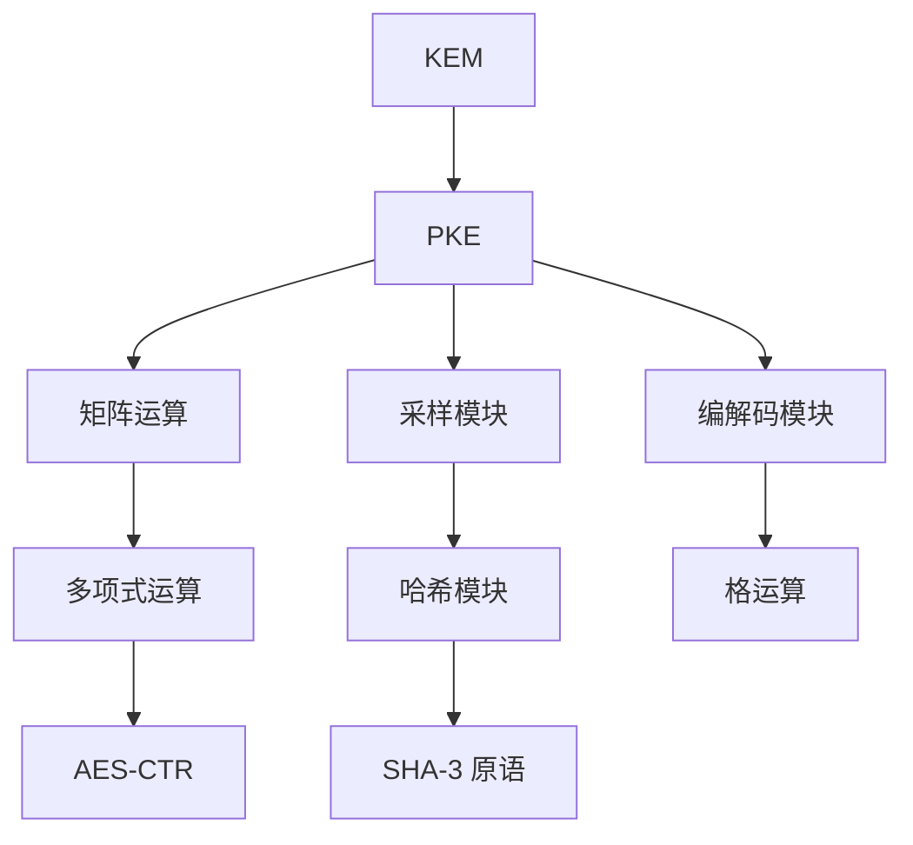

### SCloudPlus 密码学方案实现文档

#### 1. 密码学原语及随机数模块

1. **AES 模块 (aes.c/aes.h)**
    - **功能**：提供 AES-128 CTR 模式加密，支持硬件加速
    - 核心函数：
        - `AES128_load_schedule()`：从密钥生成轮密钥（支持 x86 AES-NI 和 ARM Neon）
        - `AES128_CTR_enc_sch()`：使用轮密钥进行 CTR 模式加密
        - `AES128_free_schedule()`：安全擦除轮密钥
    - 特殊处理：
        - x86 使用 `_mm_aesenc_si128` 指令
        - ARM 使用 `vaeseq_u8` 和 `vaesmcq_u8` 指令
        - x86 使用开源代码,ARM 参考linux内核AES版本实现

2. **哈希模块 (hash.c/hash.h)**
    - **功能**：基于 Keccak 实现 SHA-3 系列函数
    - 核心组件：
        - SHAKE128/256 XOF：`shake128_init()`, `shake128_squeeze()` 等
        - SHA3-256/512：`sha3_256()`, `sha3_512()`
        - 此部分使用开源代码
    - 方案专用包装函数：
        - `scloudplus_F()`：使用 SHAKE256 作为 PRF
        - `scloudplus_H()`：使用 SHA3-256 作为哈希
        - `scloudplus_G()`：使用 SHA3-512 作为 KDF
        - `scloudplus_K()`：使用 SHAKE256 作为 KDF

3. **随机数模块 (random.c)**
    - **功能**：系统级安全随机数生成
    - 跨平台实现：
        - Windows: `CryptGenRandom()`
        - Linux/macOS: `/dev/urandom`
    - 核心函数：`randombytes()`

#### 2. 核心算法模块

1. **矩阵操作 (matrix.c/matrix.h)**
    - **功能**：标准矩阵运算
    - 核心操作：
        - 加/减：`scloudplus_add()`, `scloudplus_sub()`
        - 矩阵乘法：`scloudplus_mul_cs()` (C*S), `scloudplus_mul_add_sb_e()` (S*B + E)
    - 优化：循环展开和 SIMD 友好设计

2. **采样模块 (sample.c/sample.h)**
    - **功能**：基于哈希的离散高斯采样
    - 核心采样器：
        - `scloudplus_sampleeta1()`：生成 η1 分布错误矩阵，需要随机数个数确定，`m*nbar*eta1*2`bit。
        - `scloudplus_sampleeta2()`：生成 η2 分布错误矩阵，需要随机数个数确定，`mbar*n*eta2*2`bit。
        - `scloudplus_samplepsi()`：生成稀疏私钥矩阵
        - `scloudplus_samplephi()`：生成稀疏噪声矩阵
    - 采样技术：
        - CBD（Center Binomial Distribution）
        - 拒绝采样（Rejection Sampling）

3. **采样+矩阵操作模块 (sample.c/sample.h)**
    - **功能**：基于AES的均匀分布采样+分块矩阵运算
    - 均匀采样：
        - 使用`AES128_CTR_enc_sch()`生成批量随机数，虽然模数为12比特，但是采用两字节作为采样结果。
          如果采用3字节产生两个随机数的方式，由于使用指令集实现，虽然AES次数更少，但是拼接过程引入性能开销更大。
    - 分块矩阵运算：
        - 此处实现参考FrodoKEM的矩阵运算。[https://eprint.iacr.org/2021/711](The Matrix Reloaded:
          Multiplication Strategies in FrodoKEM)

4. **编码模块 (encode.c/encode.h)**
    - **功能**：消息与格之间的相互转换
    - 核心算法：
        - **消息编码**：`scloudplus_msgencode()`
            - 使用 Barnes-Wall 格编码（Algorithm 2）
            - 分步：`compute_v()` → `compute_w()`
        - **消息解码**：`scloudplus_msgdecode()`
            - BDD 解码算法：`bddbwn()`
            - 分步：`recover_v()` → `recover_m()`
    - 辅助函数：
        - 复数运算：`complex_add()`, `complex_mul()`,此处可优化为无浮点数操作。
        - 格约简：`reduce_w()`

#### 3. 密码学方案实现

1. **PKE 方案 (pke.c/pke.h)**
    - **算法**：基于 LWE 的 CPA 安全公钥加密
    - 密钥生成：
      ```c
      void scloudplus_pkekeygen(uint8_t *pk, uint8_t *sk)
      1. 生成种子 α ← randombytes(32)
      2. 扩展种子：seedA || r1 || r2 = F(α)
      3. 采样 S ← ψ(r1), E ← η1(r2)
      4. 计算 B = A·S + E (A 由 seedA 生成)
      5. 打包 pk = pack(B) || seedA, sk = pack(S)
      ```
    - 加密：
      ```c
      void scloudplus_pkeenc(uint8_t *pk, uint8_t *m, uint8_t *r, uint8_t *ctx)
      1. 扩展随机数：r1 || r2 = F(r)
      2. 采样 S1 ← φ(r1), E1 ← η2(r2), E2 ← η2(r2)
      3. 编码消息：μ = encode(m)
      4. 计算 C1 = Aᵀ·S1 + E1, C2 = Bᵀ·S1 + E2 + μ
      5. 压缩并打包 ctx = pack_c1(C1) || pack_c2(C2)
      ```
    - 解密：
      ```c
      void scloudplus_pkedec(uint8_t *sk, uint8_t *ctx, uint8_t *m)
      1. 解包 C1, C2 = unpack(ctx)
      2. 计算 μ' = C2 - Sᵀ·C1
      3. 解码 m = decode(μ')
      ```

2. **KEM 方案 (kem.c/kem.h)**
    - **算法**：IND-CCA2 安全的密钥封装
    - 密钥生成：
      ```c
      void scloud_kemkeygen(uint8_t *pk, uint8_t *sk)
      1. 调用 pke_keygen 生成 (pk, sk_pke)
      2. 计算 h = H(pk)
      3. 保存 sk = sk_pke || pk || h || z (z←randombytes(32))
      ```
    - 封装：
      ```c
      void scloud_kemencaps(uint8_t *pk, uint8_t *ctx, uint8_t *ss)
      1. 生成随机 m ← randombytes(ss_len)
      2. 计算 r = G(m || H(pk))
      3. 调用 pke_enc(pk, m, r) → ctx
      4. 计算 ss = K(r || ctx)
      ```
    - 解封装：
      ```c
      void scloud_kemdecaps(uint8_t *sk, uint8_t *ctx, uint8_t *ss)
      1. 调用 pke_dec(sk, ctx) → m'
      2. 计算 r' = G(m' || h) (h 来自 sk)
      3. 重新加密：ctx' = pke_enc(pk, m', r')
      4. 验证：if ctx == ctx' then ss = K(r' || ctx)
                else ss = K(z || ctx) (z 来自 sk)
      ```

#### 4. 辅助模块

1. **参数系统 (param.h)**
    - 支持 128/192/256 位安全级别
    - 动态配置：
      ```c
      #if (scloudplus_l == 128)
      #define scloudplus_m 600
      #define scloudplus_n 600
      #define scloudplus_eta1 7  // 错误分布参数
      ...
      #endif
      ```

2. **工具函数 (util.c/util.h)**
    - 安全工具：
        - `scloudplus_verify()`：常数时间内存比较
        - `scloudplus_cmov()`：常数时间条件移动
    - 数值工具：`my_round()`：抗侧信道舍入函数

#### 5. 系统架构图



#### 6. 关键设计特点

1. **基本侧信道防护**：
    - 分支操作使用常数时间实现
    - 内存比较和条件移动使用位掩码技术
    - 浮点数舍入屏蔽符号位

2. **性能优化**：
    - AES-NI/ARMv8 硬件加速
    - 矩阵运算循环展开
    - 批量化采样处理

3. **内存安全**：
    - 敏感数据（密钥/采样）显式清零
    - 堆内存分配有严格边界检查

4. **参数灵活性**：
    - 通过宏开关支持 3 种安全级别
    - 动态调整环维度/错误分布等参数

#### 7. 使用示例

```c
// KEM 全流程示例
uint8_t pk[SCLOUDPLUS_PK_BYTES];
uint8_t sk[SCLOUDPLUS_SK_BYTES];
uint8_t ct[SCLOUDPLUS_CT_BYTES];
uint8_t ss1[SCLOUDPLUS_SS_BYTES];
uint8_t ss2[SCLOUDPLUS_SS_BYTES];

// 密钥生成
scloud_kemkeygen(pk, sk);

// 封装
scloud_kemencaps(pk, ct, ss1);

// 解封装
scloud_kemdecaps(sk, ct, ss2);

// 验证
assert(memcmp(ss1, ss2, SCLOUDPLUS_SS_BYTES) == 0);
```

> 交付说明：本实现严格遵循基于格的密码学方案设计，通过模块化结构提供 CPA 安全的 PKE 和 CCA2 安全的 KEM。
> 参数系统支持 NIST L1/L3/L5 安全等级。 